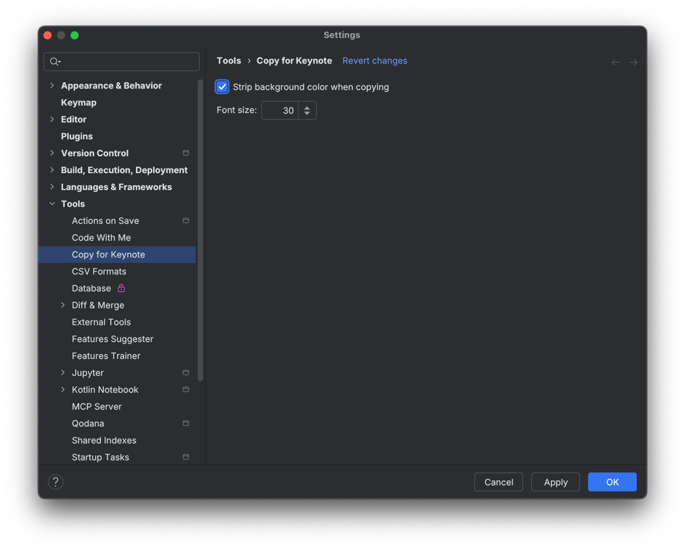
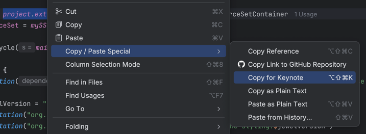

# Copy for Keynote plugin

This is an IntelliJ IDEA plugin that allows you to copy code from the editor and paste it into Apple Keynote while
preserving syntax highlighting. The copied code is stripped of its background colour, and the font size is set to
a more desirable value. Both are configurable:

## Installation

The plugin can be downloaded from
the [JetBrains plugins marketplace](https://plugins.jetbrains.com/plugin/28758-copy-for-keynote).

## Usage

Select some text in the editor, then right-click -> _Copy / Paste Special_ -> _Copy for Keynote_:

The action is bound by default to <kbd>⌥ Option</kbd> + <kbd>⌘ Command</kbd> + <kbd>⇧ Shift</kbd> + <kbd>K</kbd> on
macOS, and <kbd>Ctrl</kbd> + <kbd>Alt</kbd> + <kbd>Shift</kbd> + <kbd>K</kbd> elsewhere.

## License

This plugin is licensed under the Apache 2.0 License. See the [LICENSE](LICENSE) file for more details.
